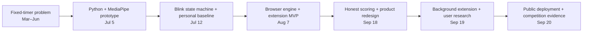
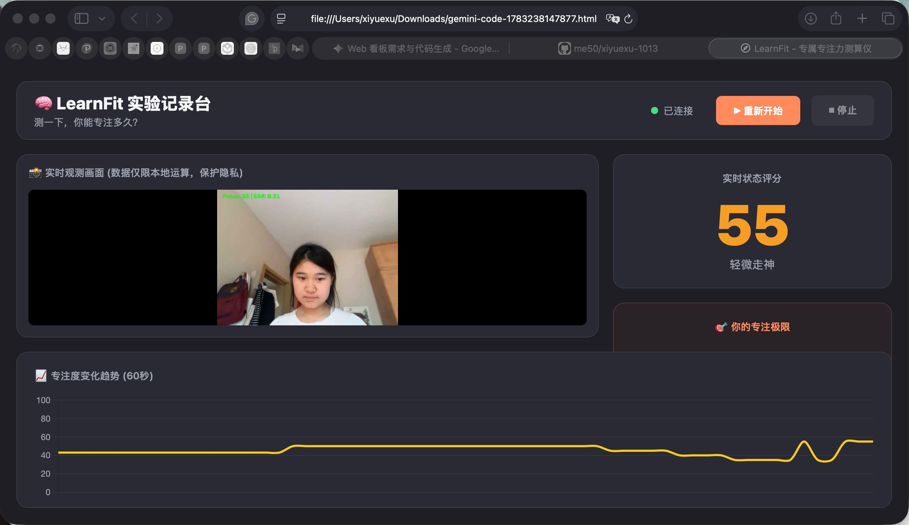
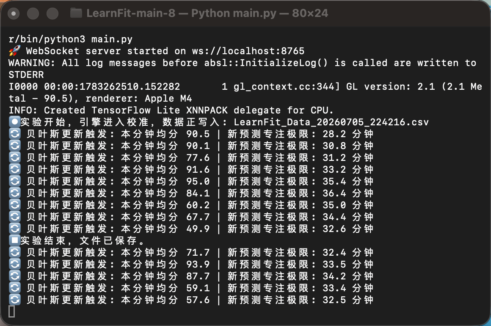
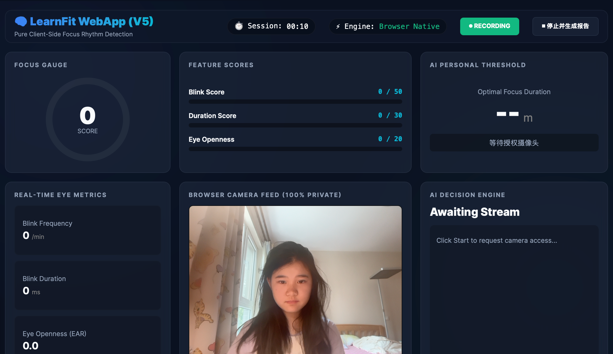
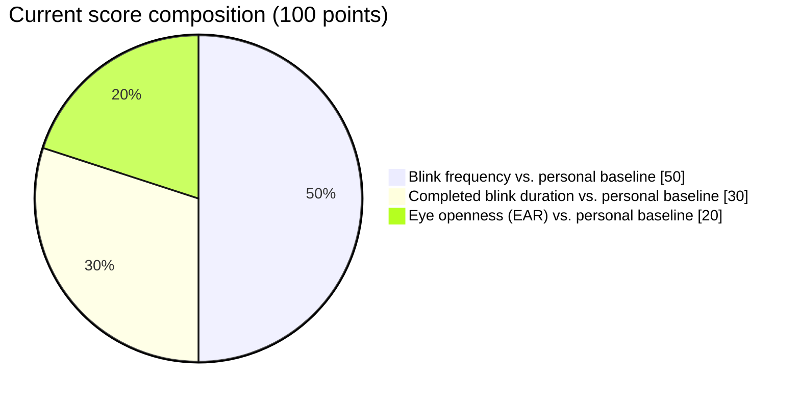
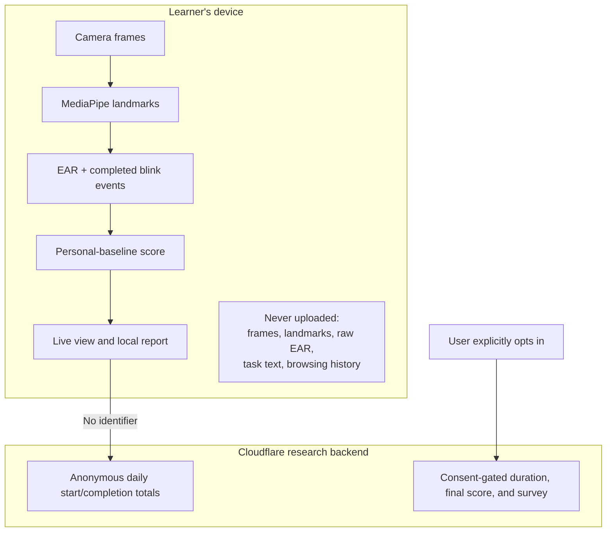

# LearnFit Development Journal

This is the story of why I built LearnFit, what failed in each version, and how those failures changed the product. Dates from July onward are supported by the repository history. The March–June entry comes from my early design and experiment notes, before I had a complete project on GitHub.

## The project at a glance



The screenshots below come from my own development and testing environment. They show real intermediate versions, including interfaces and terminology that I later changed.

## March–June 2026 — The question that started it

I started with a problem I had with the Pomodoro method.

Pomodoro timers are useful, but they usually begin by giving everyone the same schedule: study for a fixed number of minutes, rest, and repeat. I did not think one schedule could fit every person, every subject, or even the same person on two different days. I sometimes noticed that I could study well for a long time, but on other days I could no longer focus after about an hour.

My first question was therefore not, “How can I make people study for longer?” It was: **Could a tool help someone notice their own changing study rhythm instead of borrowing a universal timer?**

I chose the Eye Aspect Ratio, or EAR, as my first observable signal. EAR uses six landmarks around each eye to estimate how open the eye is. A sharp drop followed by a recovery can be treated as a possible blink. A longer or unusual change might mean a long eye closure, a head movement, a lost face, poor lighting, or a tracking error. That ambiguity became important later.

I initially sketched a 100-point scoring system:

- **50 points for blink frequency.** I experimented with fixed breakpoints around 10 and 17 blinks per minute, with larger penalties as the count increased.
- **30 points for blink duration.** I used roughly 250 ms as an early reference and considered increasing the penalty for each additional 50 ms, with a long closure around 500 ms treated separately.
- **20 points for an eye or pupil signal.** My earliest notes included rules based on small pupil-size changes sustained for about one second.

Those numbers were engineering guesses, not medical standards. I later learned that a normal, uncalibrated webcam cannot reliably measure physical pupil changes in millimeters. Distance from the camera, lens properties, lighting, and automatic exposure all affect the image. The shipped product therefore does not claim to measure pupil diameter. It uses normalized EAR, completed blink events, and a personal baseline instead.

## July 5, 2026 — The first working prototype

This is the first day with a complete trail of GitHub commits. I built the original pipeline with Python, OpenCV, MediaPipe, and a browser dashboard:

`camera → face landmarks → EAR → blink detection → score → WebSocket → dashboard`

I separated the program into camera capture, face detection, eye features, blink detection, head pose, fatigue rules, scoring, WebSocket communication, and the dashboard. For the first time, I could see a live signal move on a chart while I studied.



*The early experiment dashboard. It displayed the camera feed, a live score, a suggested duration, and a 60-second trace. This version still used stronger “focus” language than I use today.*

Getting a graph on screen was exciting, but using it exposed the real problems immediately:

- One absolute EAR threshold did not fit different eye shapes, glasses, camera angles, or lighting.
- A blink lasts across several video frames, so careless logic can count it several times or miss it completely.
- When the camera dropped a frame or lost the face, the system could confuse “no observation” with “poor focus.”
- Python, WebSocket, and the webpage all had to run together. Moving to another computer meant rebuilding the environment.
- The dashboard looked like a research demo rather than something another student could open and understand.

I made many small commits that day because the camera, timing, data format, and page connection kept revealing edge cases. I used AI tools to discuss possible fixes, but I still had to read the code, decide which suggestions made sense, rewrite parts myself, and test them against the camera. This was the first time LearnFit moved from “a concept that runs” toward “a system that can keep running.”

## July 8, 2026 — Rethinking what the score meant

While rewriting the project explanation, I became uncomfortable with the phrase “attention score.” A webcam can observe eye openness, blinks, and whether a face is visible. It cannot know what a person is thinking.

That realization changed the direction of the project. I began describing the output as a **focus rhythm** or **study rhythm** signal: one clue that a learner can compare with their own experience, rather than a verdict about intelligence, effort, or self-control.

## July 12, 2026 — The first serious debugging round

This iteration focused on the question I kept running into: why were the blink values so inconsistent?

- I changed blink detection into a state machine. A falling EAR starts an eye closure; the blink is counted only after the eye opens again.
- I separated a quick blink from a sustained closure so one long closure would not become many blinks.
- I added divide-by-zero protection for damaged landmarks and extremely small EAR baselines.
- I refactored the command queue and WebSocket data handling to reduce conflicts among start, pause, and stop actions.
- I added a 30-second personal baseline so the program could observe the current user before comparing later behavior.
- I continued revising the dashboard so the score, curve, and current state were easier to read.

The Python version averaged the latest 90 frames to reduce single-frame noise. It also used each minute's average to gradually update a suggested study duration. I originally labeled this section “Bayesian updating.” Looking back, **adaptive weighted updating with a decreasing gain** is a more accurate description; it was not a complete, validated probabilistic model. I kept the useful idea—adjust gradually instead of reacting to one frame—but removed the inflated claim.



*A real terminal run from July 5. The log shows the local WebSocket server, CSV experiment recording, minute averages, and the changing duration estimate. It is also evidence of terminology I later corrected.*

## August 7, 2026 — Moving from Python to the browser

I began rewriting the core in JavaScript and created separate `engine`, `tracker`, and `landmarks` modules, together with the first Chrome extension prototype.

The browser now requested the camera through `getUserMedia`, and MediaPipe ran locally through JavaScript and WebAssembly. A user no longer needed to install Python, start a local server, or connect to a WebSocket. The scoring engine was also separated from the interface so the website and extension could share the same logic.

This move established the project's privacy direction: video frames and facial landmarks should be processed on the user's device, not uploaded or saved. It also removed a large setup barrier for people who simply wanted to try the idea.

The first extension was still incomplete. When a normal webpage was hidden or closed, browser throttling and tab lifecycle rules could pause camera work and timing. The popup looked like an extension, but it did not yet provide a reliable background session.



*The browser-native V5 dashboard. This version removed the Python setup and exposed the 50/30/20 components, but its dark control-panel design and “AI” labels still felt more confident than the evidence justified.*

## September 18, 2026 — Rebuilding both the score and the product

Instead of adding more impressive algorithm names, I reviewed what every number actually represented and where the interface could mislead someone.

I kept the original **50 / 30 / 20** structure, but changed the comparison from a universal rule to the learner's own baseline:

- **50 points for blink frequency:** a penalty begins only when the current frequency rises to roughly 130% of that session's personal baseline.
- **30 points for blink duration:** duration is recorded only for a completed blink, and a penalty begins roughly 50 ms above the personal baseline.
- **20 points for eye openness:** the current EAR is compared with the learner's baseline EAR. The product does not claim to measure pupil size in millimeters.



I also corrected several less visible problems:

- The 30-second calibration advances only while a usable face signal exists. A long gap cannot silently finish calibration.
- If no blink is observed, the system does not invent a blink duration or penalize the user for missing data.
- I replaced the 90-frame average with exponential smoothing using a 1.5-second time constant, so computers with different frame rates respond more consistently.
- Tracking gaps appear as gaps in the chart instead of being filled with a low score.
- A duration suggestion requires enough usable data and a sustained change later in the session.
- The states became `Stable`, `Shifting`, and `Break suggested`, with an explicit explanation that they are heuristics rather than a direct measurement of attention.

I also redesigned the interface. I did not want another polished but anonymous technology dashboard, so I used an editorial layout, Instrument Serif, a maker's note, visible limitations, and a public build log. The score and elapsed study time became the clearest elements because users need to understand what is happening now before reading any product language.

## September 19, 2026 — Making the extension truly continue in the background

To keep a user-started session running after the LearnFit page was closed or the learner switched to other study material, I rebuilt the extension around Manifest V3:

- A service worker coordinates session state and messages.
- An offscreen extension document performs the local camera processing after the user starts a session.
- `chrome.storage.local` preserves timing, calibration progress, score, and the current suggestion.
- The popup becomes a control and display surface rather than the process that must stay open.

With this design, normal Chrome tabs can change or close without ending the LearnFit session. Pausing stops the study clock, and ending releases the camera. The extension still follows Chrome's lifecycle and permissions; it does not secretly keep running after the entire browser is quit.

I also added an optional five-minute evaluation and a research dashboard for real-user testing. I separated two kinds of evidence:

- Start and completion events add to daily totals without storing a person or session identifier.
- Duration, final score, and survey answers are submitted only after explicit consent.

Camera frames, facial landmarks, raw EAR measurements, task text, browsing history, and locally saved reflections are not uploaded. The dashboard summarizes anonymous use and feedback and can export CSV evidence for student innovation competitions.



## September 20, 2026 — Publishing and documenting the project

I published the redesigned app on the free Cloudflare Pages address: <https://learnfit.pages.dev/>. A Pages Function forwards only `/api/*` requests to the existing Cloudflare Worker, allowing the public site, anonymous totals, and optional feedback system to work together.

I completed the favicon and application icon set, privacy policy, Chrome Web Store materials, Congressional App Challenge notes, testing instructions, recruitment posters, and scannable QR codes. I moved the original Python prototype into `legacy/` instead of deleting it, so reviewers can inspect the path from the first research code to the current browser product.

## What changed in my technical thinking

1. **From one timer to a personal baseline.** I started by trying to improve a fixed score. I learned that the more important problem is that each learner has a different normal pattern.
2. **From one frame to evidence over time.** A single frame is fragile. Completed events, sustained changes, and honest gaps are more useful than an instant label.
3. **From “measuring attention” to offering a clue.** LearnFit cannot know what someone is thinking. It can show observable rhythm changes and let the learner interpret them alongside their own experience.
4. **From a server pipeline to local processing.** Moving MediaPipe and scoring into the browser reduced setup and kept the most sensitive visual data on the device.
5. **From a technical demo to a testable product.** Background behavior, permission handling, privacy language, edge cases, feedback, and real usage evidence matter as much as the scoring formula.
6. **From impressive language to accurate language.** Earlier versions used phrases such as “Bayesian,” “pupil millimeters,” and “attention detection” too confidently. Building the product taught me to separate an engineering heuristic from a validated scientific claim.

## What I still need to test

- How lighting, skin tone, eye shape, glasses, camera angle, and device frame rate affect the signal.
- How to distinguish reading paper, looking down to write, leaving the desk, and losing face tracking.
- Whether a personal baseline is stable across sessions or should always be rebuilt.
- Whether the score agrees with a learner's own experience and task progress.
- Whether the suggested session length is useful in practice rather than merely plausible.

These questions require real participants and longer-term evidence. Until that evidence exists, LearnFit will remain a study-rhythm experiment—not a diagnostic tool or an absolute measure of concentration.

## Verification

The automated suite currently covers personal calibration, long tracking gaps, session resets, blink duration, EAR calculation, frame-rate-independent smoothing, evidence rules for reports, local reflections, pause and resume, anonymous aggregate validation, and consent-gated detailed feedback.

```sh
npm test
```
